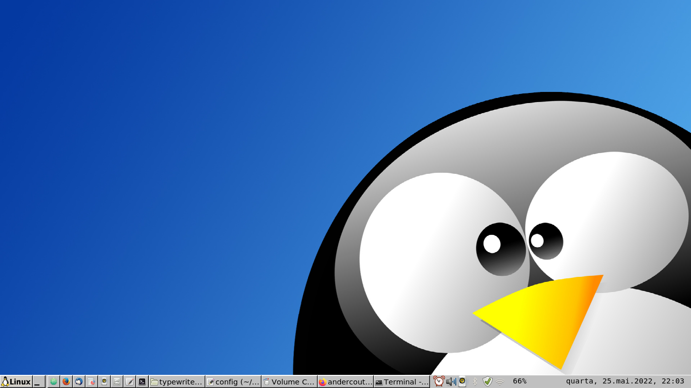

# tema para o icewm



## instalação

para instalar o icewm

```bash
sudo apt install -y icewm volumeicon-alsa
```

para instalar o tema

```bash
git clone https://github.com/andercoutos/.icewm.git ~/.icewm && chmod +x ~/.icewm/preferences

```

