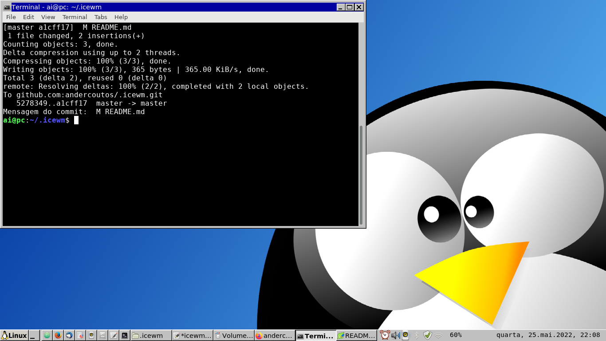

# tema para o icewm

## sobre

pra quem quer saber qual é o meu desktop eu uso o linux mint versão xfce (ubuntu) como base para o gerenciador de janelas [icewm](https://ice-wm.org/) com esse tema customizado



## instalação

para instalar o icewm

```bash
sudo apt install -y alarm-clock-applet blueman-applet clipit icewm lxpolkit suckless-tools volumeicon-alsa xfce4-screenshooter xfce4-terminal
```

para instalar o tema

```bash
git clone https://github.com/andercoutos/.icewm.git ~/.icewm && chmod +x ~/.icewm/preferences

```

